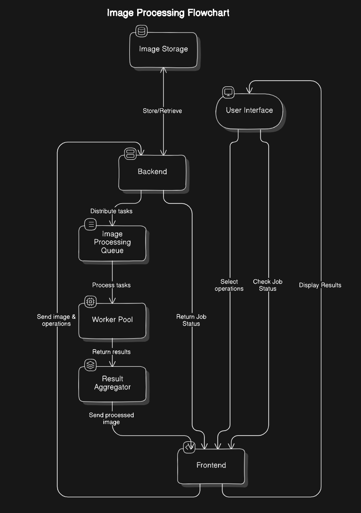

This is a web application that allows users to upload images, apply various processing operations, and download the processed output. The frontend is built with Next.js, and the backend is powered by FastAPI.

## Flowchart




## Prerequisites

### Frontend
- Node.js (v14+)
- npm (v6+)

### Backend
- Python 3.8+
- Pip (Python package installer)

## Setup Instructions

### Frontend (Next.js)

1. Navigate to the `client` directory:
   ```bash
   cd client
   ```
2. Install the dependencies:
   ```bash
   npm install
   ```
3. Start the development server:
   ```bash
   npm run dev
   ```
   The application should be available at `http://localhost:3000`.

### Backend (FastAPI)

1. Navigate to the `server` directory:
   ```bash
   cd server
   ```
2. Install the required packages:
   ```bash
   pip install -r requirements.txt
   ```
3. Copy the `.env.example` file to `.env` and fill in the required environment variables:
   ```bash
   cp .env.example .env
   ```
   Then edit the `.env` file with your specific configuration.

4. Start the FastAPI server:
   ```bash
   python3 main.py
   ```
   The FastAPI server should be available at `http://localhost:8000`.

5. Start the background worker:
   ```bash
   python3 worker.py
   ```
   This command starts the worker for handling background tasks.

## How It Works

1. **Upload an Image**: Use the frontend to select and upload an image.
2. **Apply Processing**: Choose from options like resizing, filtering, or adjusting brightness.
3. **Download Processed Image**: Once processing is complete, download the image.

## Additional Information

- The frontend and backend communicate via API requests.
- The project uses RQ (Redis Queue) and Redis for managing background tasks.
- S3 is used for image storage, and PIL (Python Imaging Library) is used for processing images.
